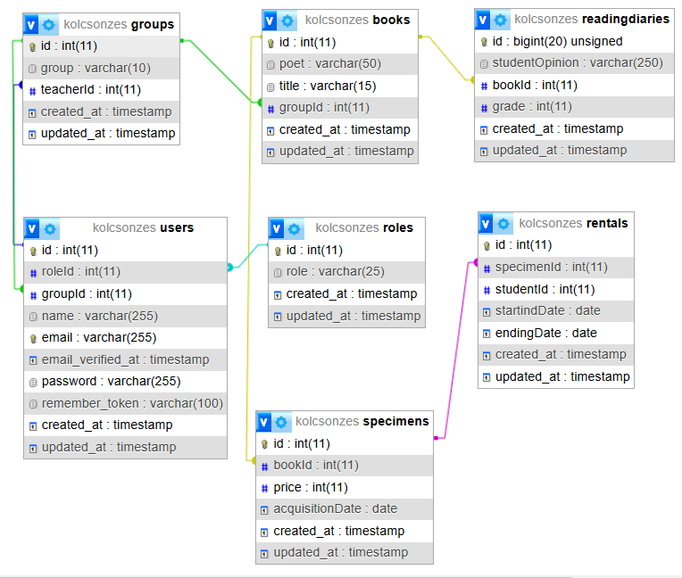

# Documantacion

## Feladat leírása

A feladat, egy online könyv kölcsönzésről szól diákoknak és tanároknak. Lehetőséget ad a tanulóknak, hogy a tanárok által előírt könyvet kikölcsönözzék és véleményt adjanak róla, amit a tanárok értékelnek. Emellett a tanárok megtudják változtatni évfolyamonként a kötelező olvasmányt és a határidőt is tudják csúsztatni.

## Table

- Books (Muvek)
    - id: A művek azonosítója.
    - poet (szerzo): A köny szerzője, aki megírta a könyvet.
    - title (cim): A cím a szöveg egészére vonatkozó indító formula.
    - groupId (evfolyamId): Melyik évfolyamnak kötelező olvasmánya.

- Users
    - id: A felhasználók azonosítója.
    - name (nev): A felhasználó megnevezése.
    - roleId (szerepkor): A felhasználó jogosultságait meghatározó köre.
    - groupId (evfolyamId):A felhasználó évfolyama.

- Groups (Evfolyamok)
    - id: Az évfolyamok azonosírója.
    - group (evfolyam): X évfolyamok.
    - teacherId (tanarId): X évfolyamhoz tartozó tanár

- Rentals (Kolcsonzesek)
    - id: A kikölcsözött művek azonosítója.
    - specimenId (peldanyId): X mű példánynak azonosítója.
    - studentId (diakId): X kölcsönző diák azonosítója.
    - startingDate (kezdpDatum): Kikölcsönzés kezdeti dátuma.
    - endingDate (befejezesDatum): Kikölcsönzés befejezési dátuma.

- Specimen (Peldanyok)
    - id: A művek pélányainak azonosítója
    - bookId (muId): X mű azonosítója
    - price (ar): A példánynak az ára
    - acquisitionDate (beszerzesDatum): A mű beszerzési dátuma a könyvtárba.

- readingDiaries (Olvasonaplok)
    - id: Az olvasónaplók azonosítója
    - studentOpinion (diakVelemeny): A diák(ok) véleménye X műhöz
    - bookId (muId): X mű azonosítója
    - grade (ertekeles): A tanár értékelése

- Roles (szerepkorok)
    - id: A szerepkörök azonosítója.
    - role (szerepkor): A felhasználó jogosultságait meghatározó megnevezés.

## Diagram

