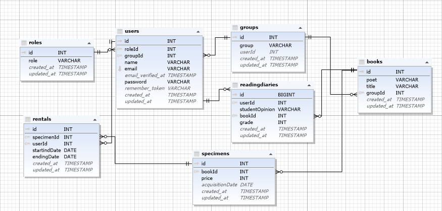

# Feladat leírása

A feladat, egy online kötelező olvasmány kölcsönzés adminisztrálásáról szól. A  a tanárok évfolmyanonként előírják hogy milyen könyvet kell a diákonak elovasniuk azokat kikölcsönzik és az elovasás után olvasónaplót kell készíteniük. A rendszer nyomom követi hogy ki mit kölcsönzött ki és milyen kötelező olvasmáynok vannak előírva évfolyamonként.
## Szerepkörök
- Admin: 
    - Tanárok, diákok regisztrálása (személyesen kell regisztrálni a könyvtárban mint a tanároknak és diákoknak).
    - Kölcsönzés adminisztrációja.
- Tanár: 
    - Meghatározza hogy évfolyamonként milyen kötelező olvasmányok vannak előírva.
    - Le tudja osztályozni az elkészült olvasónaplót.
- Diák: Kikölcsönzi a megfelelő könyveket és elkészíti az olvasmány naplót.

## Technológia

## Csapat tagjai

- Oláh Péter
    
- Nagy Ferenc

# Adatbázis

## *Table*

- Books (Muvek)
    - id: A művek azonosítója.
    - poet (szerzo): A köny szerzője, aki megírta a könyvet.
    - title (cim): A cím a szöveg egészére vonatkozó indító formula.
    - groupId (evfolyamId): Melyik évfolyamnak kötelező olvasmánya.

- Users
    - id: A felhasználók azonosítója.
    - name (nev): A felhasználó megnevezése.
    - roleId (szerepkor): A felhasználó jogosultságait meghatározó köre.
    - groupId (evfolyamId):A felhasználó évfolyama.
    - email: Mindenkinek a saját megadott e-mailje.
    - password (jelszo): A bejelentkezéshez szükséges jelszó

- Groups (Evfolyamok)
    - id: Az évfolyamok azonosírója.
    - group (evfolyam): X évfolyamok.
    - teacherId (tanarId): X évfolyamhoz tartozó tanár

- Rentals (Kolcsonzesek)
    - id: A kikölcsözött művek azonosítója.
    - specimenId (peldanyId): X mű példánynak azonosítója.
    - userId (diakId): X kölcsönző diák azonosítója.
    - startingDate (kezdpDatum): Kikölcsönzés kezdeti dátuma.
    - endingDate (befejezesDatum): Kikölcsönzés befejezési dátuma.
    - opinion (vélemény): A diák véleménye a könyvről.

- Specimen (Peldanyok)
    - id: A művek pélányainak azonosítója
    - bookId (muId): X mű azonosítója
    - price (ar): A példánynak az ára
    - acquisitionDate (beszerzesDatum): A mű beszerzési dátuma a könyvtárba.
  - grade (ertekeles): A tanár értékelése

- Roles (szerepkorok)
    - id: A szerepkörök azonosítója.
    - role (szerepkor): A felhasználó jogosultságait meghatározó megnevezés.

## *Diagram*

